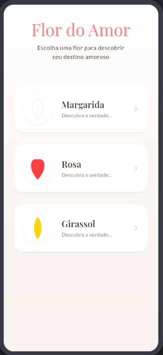
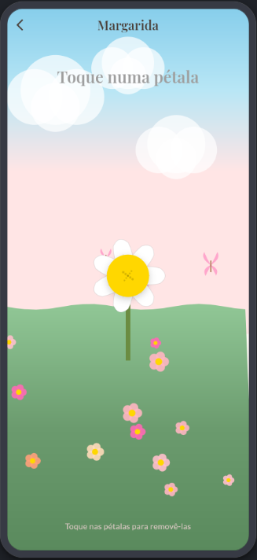

# 🌸 Flor do Amor - Bem-me-quer

**Desvende os mistérios do amor com este encantador jogo de Bem-me-quer, Mal-me-quer!**

Um aplicativo Flutter que traz o clássico jogo de "Bem-me-quer, Mal-me-quer" (He loves me, he loves me not) para o mundo digital com um design romântico e suave. Escolha sua flor favorita e descubra seu destino amoroso pétala por pétala!

## 📸 Screenshots

<p align="center">
  
  
  
</p>

> **Nota:** Para adicionar screenshots, tire capturas de tela do app rodando e salve-as na pasta `screenshots/` com os nomes: `home.png`, `game.png`, e `result.png`.

## ✨ Funcionalidades

- 🌼 **Três Tipos de Flores**: Escolha entre Margarida, Rosa ou Girassol
- 🎨 **Design Romântico**: Interface suave com tema romântico usando Material 3
- 💕 **Animações Encantadoras**: Corações flutuantes aparecem quando o resultado é "Bem-me-quer"
- 🎭 **Número Aleatório de Pétalas**: Cada flor tem entre 7 e 12 pétalas para manter o suspense
- 🎯 **Interação Intuitiva**: Toque nas pétalas para arrancá-las uma a uma
- 🎊 **Confete Comemorativo**: Celebração visual quando o amor é revelado
- 📱 **Multiplataforma**: Funciona em Android, iOS, Web, Windows, macOS e Linux

## 🛠️ Tecnologias Utilizadas

- **Flutter 3.6+**: Framework multiplataforma para desenvolvimento mobile e web
- **Dart 3.6+**: Linguagem de programação
- **go_router**: Navegação declarativa entre telas
- **provider**: Gerenciamento de estado (preparado para expansão)
- **google_fonts**: Tipografia personalizada
- **confetti**: Efeitos de confete para celebrações
- **Material 3**: Design system moderno do Google

## 🏗️ Arquitetura do Projeto

```
lib/
├── main.dart                  # Ponto de entrada da aplicação
├── nav.dart                   # Configuração de rotas (go_router)
├── theme.dart                 # Tema romântico customizado
├── models/
│   └── flower_type.dart       # Enum com tipos de flores
├── pages/
│   ├── home_page.dart         # Tela de seleção de flores
│   └── game_page.dart         # Tela do jogo principal
└── widgets/
    ├── flower_widget.dart     # Widget interativo da flor
    ├── flower_painters.dart   # CustomPainter para desenhar pétalas
    ├── garden_background.dart # Fundo decorativo
    └── rising_hearts_widget.dart # Animação de corações
```

## 🚀 Como Executar o Projeto

### Pré-requisitos

Antes de começar, certifique-se de ter instalado:

- [Flutter SDK](https://flutter.dev/docs/get-started/install) (versão 3.6 ou superior)
- [Dart SDK](https://dart.dev/get-dart) (versão 3.6 ou superior)
- Um editor de código (VS Code, Android Studio, ou IntelliJ IDEA)
- Para desenvolvimento mobile:
  - **Android**: Android Studio com Android SDK
  - **iOS**: Xcode (apenas no macOS)

### Verificar Instalação do Flutter

```bash
flutter doctor
```

Este comando verifica se todas as dependências necessárias estão instaladas corretamente.

### Passos para Executar

1. **Clone o Repositório**
   ```bash
   git clone <url-do-repositorio>
   cd bem_me_quer
   ```

2. **Instale as Dependências**
   ```bash
   flutter pub get
   ```

3. **Execute o Aplicativo**

   **Para Android/iOS (com dispositivo conectado ou emulador):**
   ```bash
   flutter run
   ```

   **Para Web:**
   ```bash
   flutter run -d chrome
   ```

   **Para Windows:**
   ```bash
   flutter run -d windows
   ```

   **Para macOS:**
   ```bash
   flutter run -d macos
   ```

   **Para Linux:**
   ```bash
   flutter run -d linux
   ```

4. **Listar Dispositivos Disponíveis**
   ```bash
   flutter devices
   ```

### Compilar para Produção

**Android (APK):**
```bash
flutter build apk --release
```
O APK estará em `build/app/outputs/flutter-apk/app-release.apk`

**Android (App Bundle):**
```bash
flutter build appbundle --release
```

**iOS:**
```bash
flutter build ios --release
```

**Web:**
```bash
flutter build web --release
```
Os arquivos estarão na pasta `build/web/`

**Windows:**
```bash
flutter build windows --release
```

**macOS:**
```bash
flutter build macos --release
```

**Linux:**
```bash
flutter build linux --release
```

## 🎮 Como Jogar

1. **Escolha uma Flor**: Na tela inicial, selecione entre Margarida, Rosa ou Girassol
2. **Arranque as Pétalas**: Toque em cada pétala para arrancá-la
3. **Acompanhe o Resultado**: O texto alterna entre "Bem-me-quer" e "Mal-me-quer"
4. **Descubra seu Destino**: A última pétala revela o resultado final!
5. **Jogue Novamente**: Escolha outra flor e tente de novo

## 📝 Estrutura do Código

### Modelos
- **FlowerType**: Enum que define os três tipos de flores com suas cores e formas de pétalas

### Páginas
- **HomePage**: Tela principal onde o usuário escolhe o tipo de flor
- **GamePage**: Tela do jogo onde as pétalas são arrancadas

### Widgets Personalizados
- **FlowerWidget**: Widget interativo que desenha a flor e gerencia as pétalas
- **FlowerPainters**: CustomPainters para desenhar diferentes formas de pétalas
- **GardenBackground**: Fundo decorativo com elementos de jardim
- **RisingHeartsWidget**: Animação de corações subindo na tela

## 🌈 Tema e Design

O aplicativo usa um tema romântico personalizado com:
- **Paleta de Cores**: Tons rosados e suaves
- **Tipografia**: Google Fonts (Caveat para títulos românticos)
- **Material 3**: Design system moderno com bordas arredondadas
- **Gradientes**: Fundos suaves e transições delicadas

## 🔧 Configuração de Desenvolvimento

### Análise de Código
O projeto usa `flutter_lints` para manter a qualidade do código. Configure seu editor para mostrar os avisos:

**VS Code**: Instale a extensão "Flutter" e "Dart"

**Android Studio**: O suporte Flutter já está integrado

### Ícones do Aplicativo
Os ícones são configurados através do `flutter_launcher_icons`. Para gerar novos ícones:

1. Coloque sua imagem em `assets/icons/`
2. Atualize o `pubspec.yaml`
3. Execute:
   ```bash
   flutter pub run flutter_launcher_icons
   ```

## 🤝 Contribuindo

Contribuições são bem-vindas! Sinta-se à vontade para:

1. Fazer fork do projeto
2. Criar uma branch para sua feature (`git checkout -b feature/NovaFuncionalidade`)
3. Commit suas mudanças (`git commit -m 'Adiciona nova funcionalidade'`)
4. Push para a branch (`git push origin feature/NovaFuncionalidade`)
5. Abrir um Pull Request

## 📄 Licença

Este projeto é um aplicativo educacional e de demonstração.

## 👨‍💻 Autor

Desenvolvido com ❤️ e Flutter

---

**Divirta-se descobrindo os mistérios do amor! 💕🌸**
